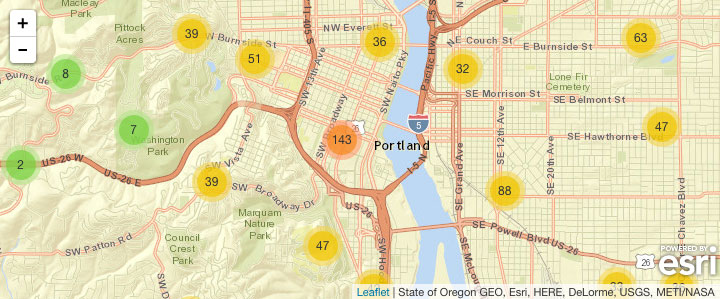

# Esri Leaflet

[](https://travis-ci.org/Esri/esri-leaflet)

Leaflet plugins wfor [ArcGIS Services](http://developers.arcgis.com). Currently Esri Leaflet supports loading Esri [basemaps](http://esri.github.io/esri-leaflet/examples/switching-basemaps.html) and [feature services](http://esri.github.io/esri-leaflet/examples/simple-feature-layer.html), as well as [tiled](http://esri.github.io/esri-leaflet/examples/tile-layer-2.html), [dynamic](http://esri.github.io/esri-leaflet/examples/simple-dynamic-map-layer.html) and [image](http://esri.github.io/esri-leaflet/examples/simple-image-map-layer.html)  map services.

The goal of Esri Leaflet is **not** to replace the [ArcGIS API for JavaScript](https://developers.arcgis.com/en/javascript/), but rather to provide small components to allow developers to build mapping applications with Leaflet.

**Currently Esri Leaflet is in development and should be thought of as a beta or preview.**

### Demos
There are [loads of demos](http://patrickarlt.github.io/esri-leaflet/examples/) showing the features of Esri Leaflet that will help you get started.

### Example
Here is a quick example to get you started. Just change the paths to point to the proper libraries and go.



```html
<html>
<head>
  <meta charset=utf-8 />
  <title>Clustering points</title>
  <meta name='viewport' content='initial-scale=1,maximum-scale=1,user-scalable=no' />

  <!-- Load Leaflet from CDN-->
  <link rel="stylesheet" href="http://cdn.leafletjs.com/leaflet-0.7.3/leaflet.css" />
  <script src="http://cdn.leafletjs.com/leaflet-0.7.3/leaflet.js"></script>

  <!-- Load Esri Leaflet from CDN -->
  <script src="http://cdn-geoweb.s3.amazonaws.com/esri-leaflet/0.0.1-beta.5/esri-leaflet.js"></script>

  <!-- Include Leaflet.markercluster via rawgit.com, do not use in production -->
  <link rel="stylesheet" type="text/css" href="https://cdn.rawgit.com/Leaflet/Leaflet.markercluster/v0.4.0/dist/MarkerCluster.Default.css">
  <link rel="stylesheet" type="text/css" href="https://cdn.rawgit.com/Leaflet/Leaflet.markercluster/v0.4.0/dist/MarkerCluster.css">
  <script src="https://cdn.rawgit.com/Leaflet/Leaflet.markercluster/v0.4.0/dist/leaflet.markercluster.js"></script>

  <!-- Load Clustered Feature Layer from CDN -->
  <script src="http://cdn-geoweb.s3.amazonaws.com/esri-leaflet/0.0.1-beta.5/esri-leaflet-clustered-feature-layer.js"></script>

  <style>
    body {margin:0;padding:0;}
    #map {position: absolute;top:0;bottom:0;right:0;left:0;}
  </style>
</head>
<body>

<div id="map"></div>

<script>
  var map = L.map('map').setView([45.526, -122.667], 15);

  L.esri.basemapLayer('Streets').addTo(map);
  L.esri.clusteredFeatureLayer('http://services.arcgis.com/rOo16HdIMeOBI4Mb/arcgis/rest/services/Trimet_Transit_Stops/FeatureServer/0').addTo(map);
</script>

</body>
</html>
```

### Documentation & Examples

A full [API Reference](http://esri.github.io/esri-leaflet/api-reference/) and plenty of [sample code](http://esri.github.io/esri-leaflet/examples/) can be found at the [Esri Leaflet](http://esri.github.io/esri-leaflet/) website.

### Development Roadmap

If you are interested in contributing to Esri Leaflet or are interetsed in seeing what is coming up next checkout the [development roadmap](https://github.com/Esri/esri-leaflet/wiki/Roadmap).

### Development Instructions

Make Sure you have the [Grunt CLI](http://gruntjs.com/getting-started) installed.

1. [Fork and clone this repo](https://help.github.com/articles/fork-a-repo)
2. `cd` into the `esri-leaflet` folder
5. Install the dependencies with `npm install`
5. run `grunt` from the command line. This will start watching the source files and running linting and testing commands.
6. Make your changes and create a [pull request](https://help.github.com/articles/creating-a-pull-request)

### Dependencies

* [Leaflet](http://leaflet.com) version 0.7 or higher is required and the latest version is recommended.
* [Esri Leaflet](http://esri.github.io/esri-leaflet/) beta 5 or or higher is required but the latest version is recommended.
* [Leaflet.markercluster](https://github.com/Leaflet/Leaflet.markercluster) version 0.4

### Resources

* [Importing Data Into Feature Services](https://developers.arcgis.com/tools/csv-to-feature-service/)
* [ArcGIS for Developers](http://developers.arcgis.com)
* [ArcGIS REST Services](http://resources.arcgis.com/en/help/arcgis-rest-api/)
* [@Esri](http://twitter.com/esri)
* [@EsriPDX](http://twitter.com/esripdx)

### Issues

Find a bug or want to request a new feature?  Please let us know by submitting an [issue](https://github.com/Esri/esri-leaflet-clustered-feature-layer/issues).

Please take a look at [previous issues on Esri Leaflet](https://github.com/Esri/esri-leaflet/issues?labels=FAQ&milestone=&page=1&state=closed) and [previous issues on Esri Leaflet Clustered Feature Layer](https://github.com/Esri/esri-leaflet-clustered-feature-layer/issues?labels=FAQ&milestone=&page=1&state=closed)that resolve common problems.

You can also post issues on the [GIS Stackexchange](http://gis.stackexchange.com/questions/ask?tags=esri-leaflet,leaflet) an/or the [Esri Leaflet place](https://geonet.esri.com/discussion/create.jspa?sr=pmenu&containerID=1841&containerType=700&tags=esri-leaflet,leaflet) on GeoNet.

### Contributing

Esri welcomes contributions from anyone and everyone. Please see our [guidelines for contributing](https://github.com/Esri/esri-leaflet-clustered-feature-layer/blob/master/CONTRIBUTING.md).

### Licensing
Copyright 2013 Esri

Licensed under the Apache License, Version 2.0 (the "License");
you may not use this file except in compliance with the License.
You may obtain a copy of the License at

> http://www.apache.org/licenses/LICENSE-2.0

Unless required by applicable law or agreed to in writing, software
distributed under the License is distributed on an "AS IS" BASIS,
WITHOUT WARRANTIES OR CONDITIONS OF ANY KIND, either express or implied.
See the License for the specific language governing permissions and
limitations under the License.

A copy of the license is available in the repository's [LICENSE](./LICENSE) file.

[](Esri Tags: ArcGIS Web Mapping Leaflet)
[](Esri Language: JavaScript)